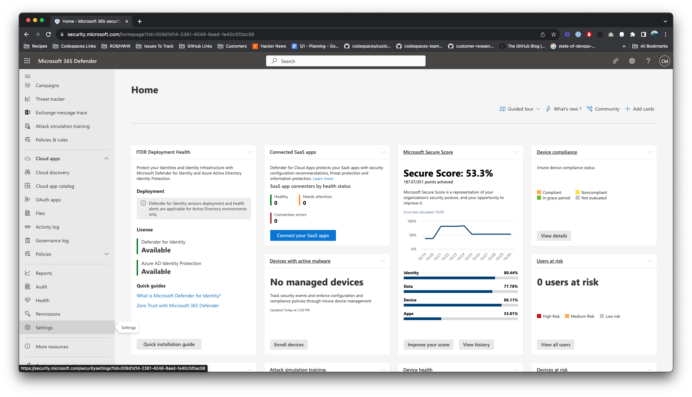
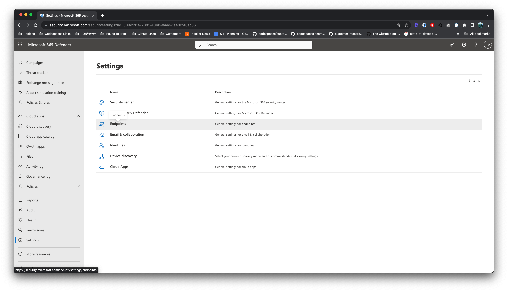
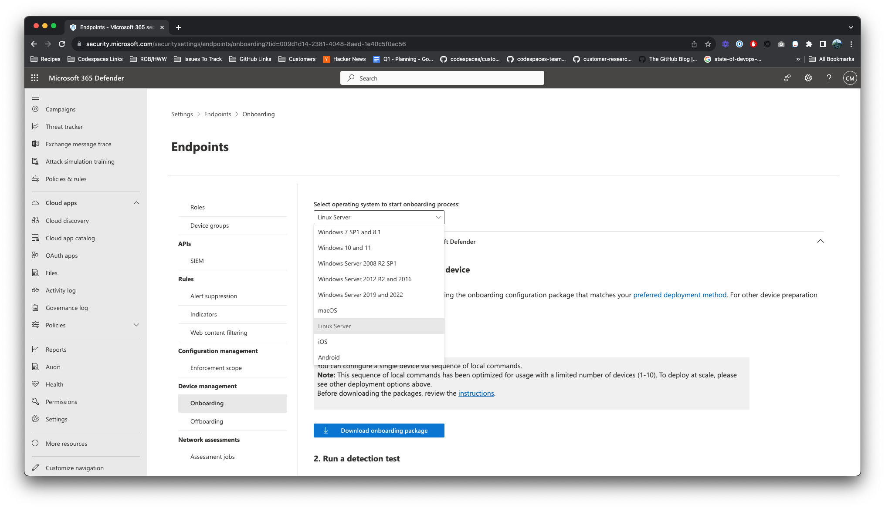
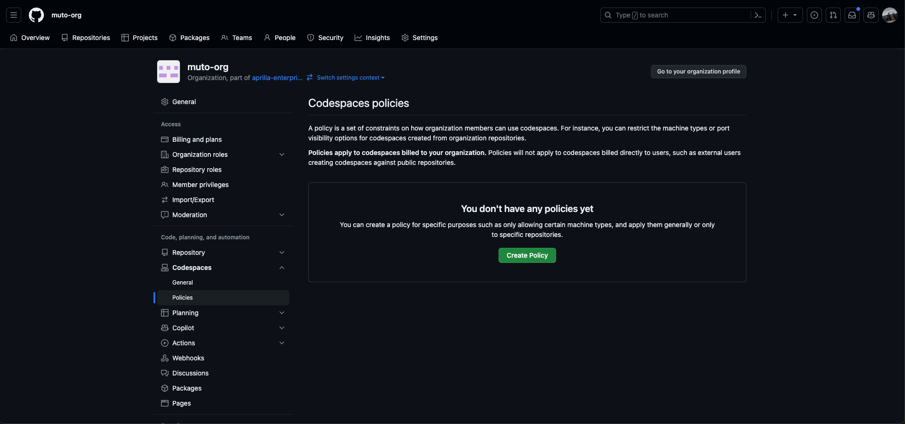
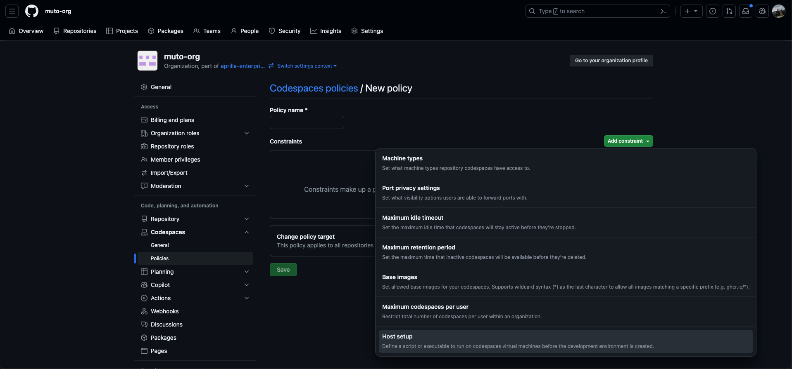
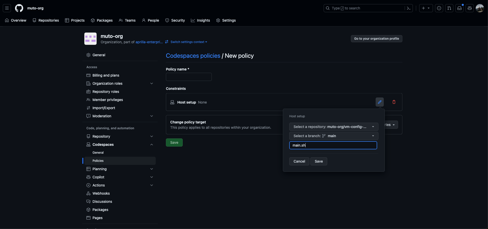
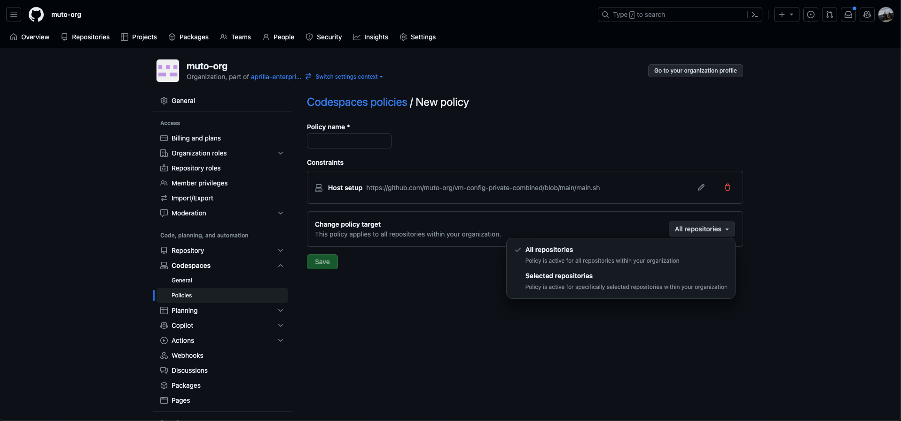
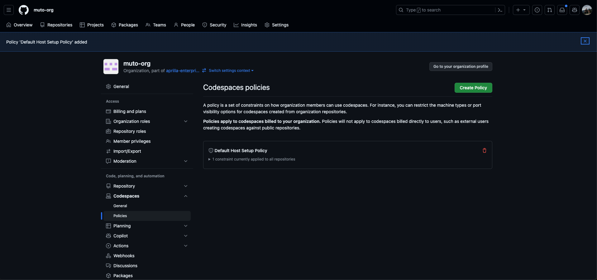
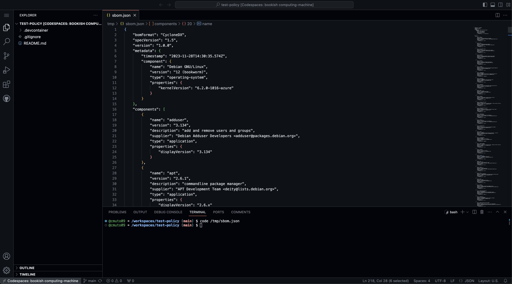

# Defender for Endpoint and SBOM Generation Host Setup Script

This repository contains a host setup script that configures two processes that should run on codespaces owned by the organization that applies this policy. This script:

- Installs and runs Microsoft Defender on Codespaces.
- Generates the software bill of materials (SBOM) for the development container every 20 seconds, and stores this information in the `/tmp` directory of the codespace.

**Note:** The host setup policy is currently in beta, so before starting you'll need to ensure you have access to this feature.

## Pre-requisites
1. An organization in GitHub that is [configured to own codespaces](https://docs.github.com/en/codespaces/managing-codespaces-for-your-organization/choosing-who-owns-and-pays-for-codespaces-in-your-organization#choosing-who-owns-and-pays-for-codespaces) that are created on its repositories
2. Access to the Host Configuration policy private beta on the organization
3. Access to Microsoft Defender for Endpoint (you can sign up for a free trial [here](https://www.microsoft.com/en-us/security/business/endpoint-security/microsoft-defender-endpoint))

## Getting Started
1. Create a version of this template repository in your organization's account. This should be the organization that has access to the Host Configuration policy in GitHub Codespaces.
2. Log into your [Microsoft Security admin panel](https://security.microsoft.com)
3. Navigate to **Settings > Endpoints > Device Management > Onboarding**
    
    
4. Select **Linux Server** as your operating system
    
5. Click **Download Onboarding Package**. Unzip the downloaded file, which should be called `MicrosoftDefenderATPOnboardingLinuxServer.py`
6. Rename this file to `onboarding.py`, and push it to the repository you created in step 1
    **Note:** This file contains your license information for Microsoft Defender, so we recommend keeping this repository private.
7. The Software Bill of Materials portion of this script does not require any additional setup.

### Configuring your host setup policy
1. Go to your organization's Codespace policies
    
2. Create a new policy, and add a **Host Setup** constraint
    
3. Configure this constraint to point to the `main.sh` file in the repository you created in the previous step
    
4. (Optional but recommended) Select which repositories you want to apply this policy to. If you select **All Repositories** it will automatically run on every codespace create or resume in this organization once the policy is created, so if there is active codespace development in this organization it is recommended to specify a test repository rather than applying to all.
   
5. Save the policy.
   

### Testing your setup
#### Validating Defender for Endpoint
Once you have completed the policy setup and configured your license, you can now test to ensure everything is working properly. To test, create a codespace on a repository within your organization. If you targeted a specific set of repositories in your host setup policy, you must create a codespace in one of these targeted repositories for the policy to take effect.

Once you have created a codespace, go to your [Microsoft Security admin panel](https://security.microsoft.com) to see detailed information about the codespace flow into Defender. This may take a few minutes.

#### Validating the Software Bill of Materials generation
1. Go to a repository where the newly configured policy applies.
2. Create a new codespace.
3. The SBOM is generated in the `/tmp/sbom.json` file. Use `code /tmp/sbom.json` to open the file in VS Code
    
4. To test the update, try installing a package that is not listed in the `sbom.json` file (e.g. `sudo apt update && sudo apt-get install cowsay`). When the script runs again, the `sbom.json` file will include this newly installed package.